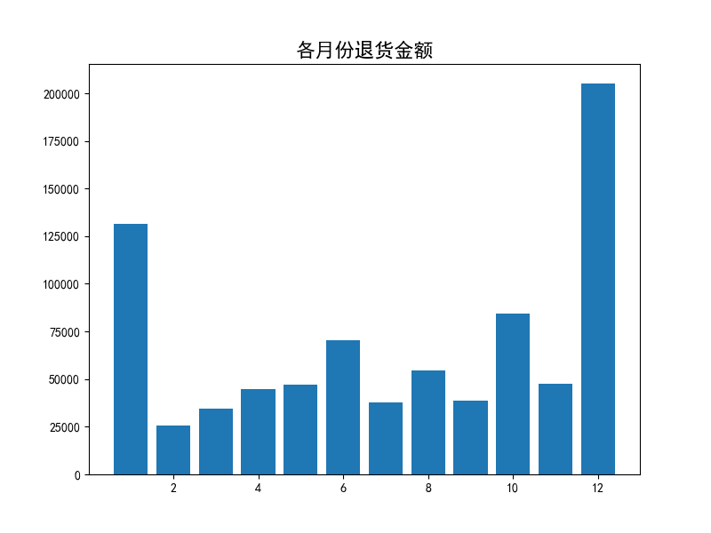
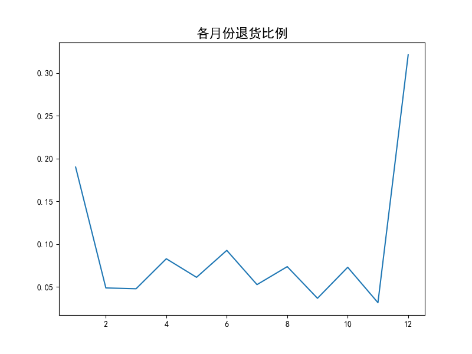
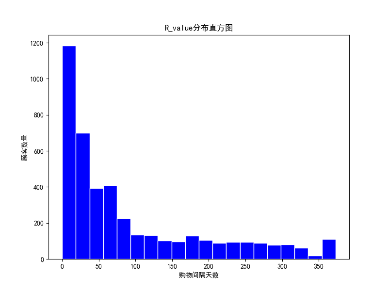
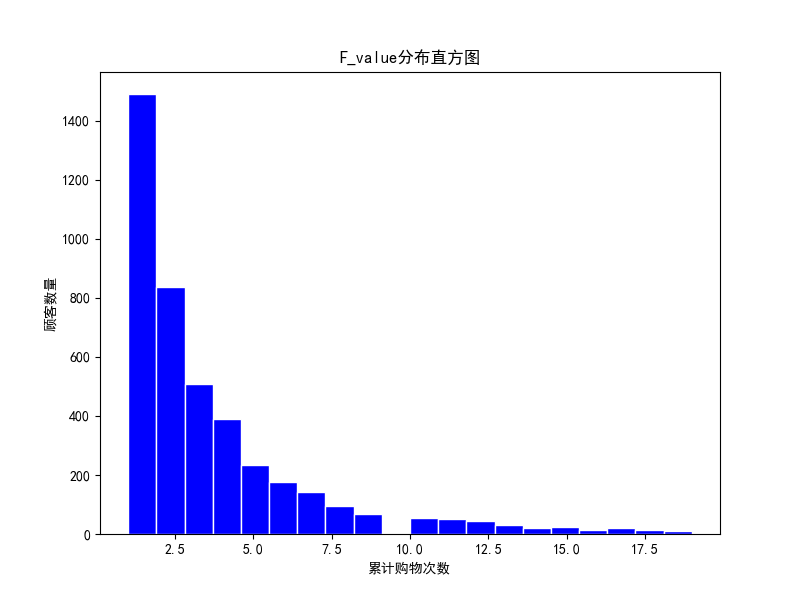
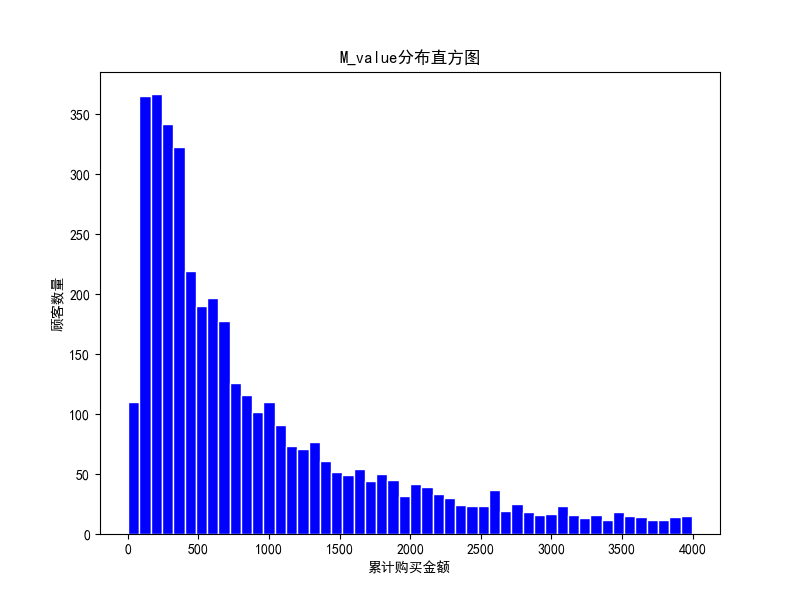
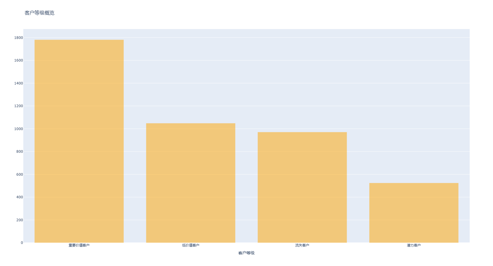
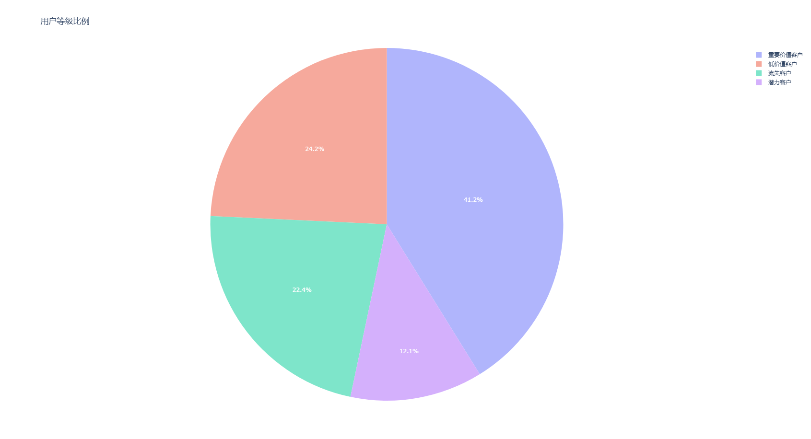

# 用RFM模型进行客户分层分析（online_retail数据集）

## 销量预测项目简介

本项目通过数据清洗和缺失值处理，确保了数据的完整性。统计退货情况揭示了退货模式和趋势，为后续分析提供依据。采用RFM模型对客户进行分层，识别高价值客户与潜力客户，并通过可视化呈现各群体特征。基于客户分层结果，制定了针对性策略：对VIP客户提供个性化服务，对潜力客户进行激活，对低活跃客户通过促销吸引回归，同时优化高退货率商品的库存和产品质量。这些措施有助于提升客户忠诚度和企业收益。

online_retail数据集这是一个跨国交易数据集，包含了2010年12月1日到2011年12月9日之间发生的所有交易，数据来自一家总部位于英国并注册的非店面在线零售公司。该公司主要销售独特的全场合礼品，该公司的许多客户是批发商，数据集具体介绍和项目代码已上传至github，下载地址：[https://github.com/gitren111/The-RFM-model-for-e-commerce-data-analysis](https://github.com/gitren111/The-RFM-model-for-e-commerce-data-analysis)

## 数据读取和预览
- count是非空值数量，这里可以看出Description、CustomerID列都有数据缺失，由于本次分析聚焦客户的金额和数量，所以Description的缺失值统一填充为0，CustomerID统一填充为字母U
```
warnings.filterwarnings('ignore')
data = pd.read_csv('online_retail.csv',encoding='utf-8',dtype={'CustomerID':str})
pd.set_option('display.max_columns', None) 
pd.set_option('display.max_rows', None)  
pd.set_option('display.width', 1000)  
print(data.head())
print(data.describe(include='all'))
```
```
       InvoiceNo StockCode                         Description       Quantity       InvoiceDate      UnitPrice CustomerID         Country
count     541909    541909                              540455  541909.000000            541909  541909.000000     406829          541909
unique     25900      4070                                4223            NaN             23260            NaN       4372              38
top       573585    85123A  WHITE HANGING HEART T-LIGHT HOLDER            NaN  2011/10/31 14:41            NaN      17841  United Kingdom
freq        1114      2313                                2369            NaN              1114            NaN       7983          495478
mean         NaN       NaN                                 NaN       9.552250               NaN       4.611114        NaN             NaN
std          NaN       NaN                                 NaN     218.081158               NaN      96.759853        NaN             NaN
min          NaN       NaN                                 NaN  -80995.000000               NaN  -11062.060000        NaN             NaN
25%          NaN       NaN                                 NaN       1.000000               NaN       1.250000        NaN             NaN
50%          NaN       NaN                                 NaN       3.000000               NaN       2.080000        NaN             NaN
75%          NaN       NaN                                 NaN      10.000000               NaN       4.130000        NaN             NaN
max          NaN       NaN                                 NaN   80995.000000               NaN   38970.000000        NaN             NaN

```

## 数据清洗：缺失值处理、客户订单的购买数量统计
### 缺失值处理
```
data.Description = data.Description.fillna(0)
data.CustomerID = data.CustomerID.fillna('U')
print(data.describe(include='all'))
```
```
       InvoiceNo StockCode                         Description       Quantity       InvoiceDate      UnitPrice CustomerID         Country
count     541909    541909                              541909  541909.000000            541909  541909.000000     541909          541909
unique     25900      4070                                4224            NaN             23260            NaN       4373              38
top       573585    85123A  WHITE HANGING HEART T-LIGHT HOLDER            NaN  2011/10/31 14:41            NaN          U  United Kingdom
freq        1114      2313                                2369            NaN              1114            NaN     135080          495478
mean         NaN       NaN                                 NaN       9.552250               NaN       4.611114        NaN             NaN
std          NaN       NaN                                 NaN     218.081158               NaN      96.759853        NaN             NaN
min          NaN       NaN                                 NaN  -80995.000000               NaN  -11062.060000        NaN             NaN
25%          NaN       NaN                                 NaN       1.000000               NaN       1.250000        NaN             NaN
50%          NaN       NaN                                 NaN       3.000000               NaN       2.080000        NaN             NaN
75%          NaN       NaN                                 NaN      10.000000               NaN       4.130000        NaN             NaN
max          NaN       NaN                                 NaN   80995.000000               NaN   38970.000000        NaN             NaN
```


### 客户订单的购买数量统计
- 每位客户在每个发票编号下购买商品记录的数量

```
temp = data.groupby(by=['CustomerID','InvoiceNo'],as_index=False)['Quantity'].count()
print('temp\n',temp.head())
```
```
   CustomerID InvoiceNo  Quantity
0      12346    541431         1
1      12346   C541433         1
2      12347    537626        31
3      12347    542237        29
4      12347    549222        24

```

## 退货情况分析
### 退货量统计
- 专门在表格里创建quantity_canceled列统计退货数量，这里发现有1270条退货记录没有匹配到原订单，这里为了简便分析没有做处理；如果想进一步处理，可以考虑将这1270条退货记录索引匹配原订单的发票号，然后针对性进行退货统计
```
data_cleaned = data.copy(deep=True)
data_cleaned['quantity_canceled'] = 0
unpaired_invoice = []#存储无法找到配对的取消订单索引
paired_invoice = []#存储已成功配对的取消订单索引。
for index,col in data.iterrows():
    # 如果数量是正数或者是折扣商品就不处理，继续下一个迭代
    if col['Quantity'] > 0 or col['Description'] == 'Discount':
        continue
    #提取出和取消订单的商品配对的原订单
    df_test = data[(data['CustomerID'] == col['CustomerID'])
                    &(data['StockCode'] == col['StockCode'])
                    &(data['InvoiceNo'] < col['InvoiceNo'])
                    &(data['Quantity']>0)]
    
    if len(df_test) == 0:
        unpaired_invoice.append(index)
    # 如果匹配到一条订单，就将quantity_canceled列对应行改为退货的数量（正数），将匹配到的索引存到paired_invoice
    elif len(df_test) == 1:
        index_order = df_test.index[0]
        data_cleaned.loc[index_order,'quantity_canceled'] = -col['Quantity']
        paired_invoice.append(index)
    #优先匹配最近时间订单，当原订单数量大于等于退货订单时保存为退货订单数量
    elif len(df_test) > 1:
        df_test.sort_index(axis=0,ascending=False,inplace=True)
        for ind,val in df_test.iterrows():
            if val['Quantity'] < -col['Quantity']:
                continue#如果原订单数量比取消订单小直接跳过
            data_cleaned.loc[ind,'quantity_canceled'] = -col['Quantity']
            paired_invoice.append(index)
            break
print(data_cleaned.head())
print(len(unpaired_invoice))
print(len(paired_invoice))
```
```
  InvoiceNo StockCode                          Description  Quantity     InvoiceDate  UnitPrice CustomerID         Country  quantity_canceled
0    536365    85123A   WHITE HANGING HEART T-LIGHT HOLDER         6  2010/12/1 8:26       2.55      17850  United Kingdom                  0
1    536365     71053                  WHITE METAL LANTERN         6  2010/12/1 8:26       3.39      17850  United Kingdom                  0
2    536365    84406B       CREAM CUPID HEARTS COAT HANGER         8  2010/12/1 8:26       2.75      17850  United Kingdom                  0
3    536365    84029G  KNITTED UNION FLAG HOT WATER BOTTLE         6  2010/12/1 8:26       3.39      17850  United Kingdom                  0
4    536365    84029E       RED WOOLLY HOTTIE WHITE HEART.         6  2010/12/1 8:26       3.39      17850  United Kingdom                  0
1270
8530
```

### 计算退货金额和比例，并可视化
- 可以发现12月和1月退货金额和占比都非常高，这里判断时圣诞节假期的影响
```
data_canceled = data[data['Quantity'] <= 0]
data_all = data[data['Quantity'] > 0]
#分别加入月和年列
data_canceled['month'] = pd.to_datetime(data_canceled['InvoiceDate']).dt.month
data_all['month'] = pd.to_datetime(data_all['InvoiceDate']).dt.month
data_canceled['year'] = pd.to_datetime(data_canceled['InvoiceDate']).dt.year
data_all['year'] = pd.to_datetime(data_all['InvoiceDate']).dt.year
#计算每条订单的总价格，退货总价为负数
data_canceled['price'] = -data_canceled['Quantity'] * data_canceled['UnitPrice']
data_all['price'] = data_all['Quantity'] * data_all['UnitPrice']
#算商品总价值和退货总价值
tt = data_canceled.groupby(['year','month'])['price'].sum().unstack()
#计算每年每月的退货总价格
pp = data_all.groupby(['year','month'])['price'].sum().unstack()
print(tt)
print(pp)


plt.figure(figsize=(8,6))
plt.title('各月份退货金额',fontsize=16)
plt.bar(tt.loc[2011].index,tt.loc[2011].values)

plt.figure(figsize=(8,6))
plt.title('各月份退货比例',fontsize=16)
plt.plot((tt/pp).loc[2011].index,(tt/pp).loc[2011].values)
plt.show()
```
```
month        1         2         3        4         5         6         7         8         9         10        11         12
year                                                                                                                         
2010        NaN       NaN       NaN      NaN       NaN       NaN       NaN       NaN       NaN       NaN       NaN   74789.12
2011   131364.3  25569.24  34372.28  44601.5  47202.51  70616.78  37921.08  54333.75  38902.55  84274.63  47740.08  205124.67
month         1          2          3           4          5         6           7          8            9          10          11         12
year                                                                                                                                         
2010         NaN        NaN        NaN         NaN        NaN       NaN         NaN        NaN          NaN        NaN         NaN  823746.14
2011   691364.56  523631.89  717639.36  537808.621  770536.02  761739.9  719221.191  737014.26  1058590.172  1154979.3  1509496.33  638792.68
```



## 客户RFM分析：R代表客户最近一次购物消费的时间，F代表客户消费的频率, M代表客户消费总金额

### 计算客户订单金额（包含了客户的退货情况）

```
data_cleaned['TotalPrice'] = (data_cleaned['Quantity'] - data_cleaned['quantity_canceled']) * data_cleaned['UnitPrice']
data_cleaned.sort_values('TotalPrice')
print(data_cleaned.sort_values('TotalPrice')[:5])
#按客户和发票分组,计算每张发票的总金额,取每张发票的第一条记录的日期
invoice_price = data_cleaned.groupby(by = ['CustomerID','InvoiceNo'],as_index=False).agg({
    'TotalPrice':'sum',
    'InvoiceDate':'first'})
invoice_price.rename(columns={'TotalPrice':'basket_price'},inplace=True)
invoice_price = invoice_price.loc[invoice_price['basket_price']>0]
print(invoice_price.head(10))
```
```
   CustomerID InvoiceNo  basket_price       InvoiceDate
2       12347    537626        711.79   2010/12/7 14:57
3       12347    542237        475.39   2011/1/26 14:30
4       12347    549222        636.25    2011/4/7 10:43
5       12347    556201        382.52    2011/6/9 13:01
6       12347    562032        584.91     2011/8/2 8:48
7       12347    573511       1294.32  2011/10/31 12:25
8       12347    581180        224.82   2011/12/7 15:52
9       12348    539318        892.80  2010/12/16 19:09
10      12348    541998        227.44   2011/1/25 10:42
11      12348    548955        367.00    2011/4/5 10:47
```
### 计算RMF值并画图
- 这里打印出R_value、F_value、M_value分位点，作为后面数据分箱的依据

```
invoice_price['InvoiceDate'] = pd.to_datetime(invoice_price['InvoiceDate'])
invoice_price['year'] = np.array([i.year for i in invoice_price['InvoiceDate']])
invoice_price['month'] = np.array([i.month for i in invoice_price['InvoiceDate']])
invoice_price['day'] = np.array(i.day for i in invoice_price['InvoiceDate'])

#R_value：最近一次消费时间距今天数，数据库最近开票与客户最近购物的时间差
R_value = invoice_price['InvoiceDate'].max() - invoice_price.groupby('CustomerID')['InvoiceDate'].max()
invoice_price_positive = invoice_price[invoice_price['basket_price']>0]#过滤掉退货的数据
F_value = invoice_price_positive.groupby('CustomerID')['InvoiceNo'].nunique()#计算订单/发票唯一值
M_value = invoice_price.groupby('CustomerID')['basket_price'].sum()
print(R_value.describe())
print(F_value.describe())
print(M_value.describe())

plt.figure(figsize=(8,6))
plt.title('R_value分布直方图')
plt.hist(R_value.dt.days,bins=20, color='blue', edgecolor='white')#.dt.days 将为每个时间差提取天数,bins=20: 这个参数指定了直方图的箱子数量
plt.xlabel('购物间隔天数')
plt.ylabel('顾客数量')

plt.figure(figsize=(8,6))
plt.title('F_value分布直方图')
plt.hist(F_value[F_value<20],bins=20,color='blue',edgecolor='white')
plt.xlabel('累计购物次数')
plt.ylabel('顾客数量')

plt.figure(figsize=(8,6))
plt.title('M_value分布直方图')
plt.hist(M_value[M_value<4000],bins=50,color='blue',edgecolor='white')
plt.xlabel('累计购买金额')
plt.ylabel('顾客数量')
plt.show()
```


```
count                           4326
mean      92 days 07:13:32.607489598
std      100 days 06:30:26.070569413
min                  0 days 00:00:00
25%                 17 days 01:44:15
50%                 50 days 02:28:00
75%                142 days 02:26:00
max                373 days 02:57:00
Name: InvoiceDate, dtype: object
count    4326.000000
mean        4.576283
std        22.703794
min         1.000000
25%         1.000000
50%         2.000000
75%         5.000000
max      1410.000000
Name: InvoiceNo, dtype: float64
count    4.326000e+03
mean     2.343715e+03
std      2.746686e+04
min      2.900000e+00
25%      3.040400e+02
50%      6.595550e+02
75%      1.631987e+03
max      1.722304e+06
Name: basket_price, dtype: float64
```




### 数据分箱

```
R_bins = [0,17,50,100,150,720]
F_bins = [1,2,3,5,20,2000]
M_bins = [0,310,700,1700,100000,2000000]
#购买天数距今越短，R_score评分越高
R_score = pd.cut(R_value.dt.days,R_bins,labels=[5,4,3,2,1],right=False).astype(int)
F_score = pd.cut(F_value,F_bins,labels=[1,2,3,4,5],right=False)
M_score = pd.cut(M_value,M_bins,labels=[1,2,3,4,5],right=False)
rmf = pd.concat([R_score,F_score,M_score],axis=1)
rmf.rename(columns={'InvoiceDate':'R_score','InvoiceNo':'F_score','basket_price':'M_score'},inplace=True)
#加入RMF列标注客户高低
rmf['R'] = np.where(rmf['R_score']>=3,'高','低')
rmf['F'] = np.where(rmf['F_score']>=3,'高','低')
rmf['M'] = np.where(rmf['M_score']>=3,'高','低')
rmf['value'] = rmf['R'] + rmf['F'] + rmf['M']
print(rmf.head(10))
```
```
            R_score F_score M_score  R  F  M value
CustomerID                                        
12347             5       4       4  高  高  高   高高高
12348             3       3       4  高  高  高   高高高
12349             4       1       4  高  低  高   高低高
12350             1       1       2  低  低  低   低低低
12352             4       4       4  高  高  高   高高高
12353             1       1       1  低  低  低   低低低
12354             1       1       3  低  低  高   低低高
12355             1       1       2  低  低  低   低低低
12356             4       3       4  高  高  高   高高高
12357             4       1       4  高  低  高   高低高
```

### 客户分层与可视化
- 客户分层：
  * 高价值客户：重要价值客户+重要发展客户，最近购买频繁或者最近有购买，且消费金额高
  * 潜力客户：重要保持客户+重要挽留客户+一般价值客户，这些客户可能最近没有购买，但购买频率或消费金额不错，值得关注
  * 低价值客户：一般发展客户+一般客户，这些客户的购买频率低且金额小，可能只是偶尔购买，价值较低
  * 流失客户：一般挽留客户，这些客户购买频率较低，且最近没有活跃的购买行为，需要通过营销活动重新激活。
- 实施策略：
  * 高价值客户：可以提供个性化的服务或忠诚计划
  * 潜力客户：可以进行促销或引导他们进行更多的购买
  * 低价值客户：可以通过营销活动提高其参与度，或者采取较低成本的维系策略
  * 流失客户：可以通过优惠券、活动或邮件提醒等方式进行重新激活
```
def trans_value(x):
    if x == '高高高' or x == '高低高':
        return '重要价值客户'
    elif x == '低高高' or x == '低低高' or x == '高高低':
        return '潜力客户'
    elif x == '高低低' or x == '低高低':
        return '低价值客户'
    else:
        return '流失客户'
rmf['用户等级'] = rmf['value'].apply(trans_value)
print(rmf['用户等级'].value_counts())

py.offline.init_notebook_mode(connected=True)
trace_basis = [go.Bar(x = rmf['用户等级'].value_counts().index,
                      y = rmf['用户等级'].value_counts().values,
                      marker = dict(color='orange'),opacity=0.5)]
layout = {
    'title' : {'text':'客户等级概览'},
    'xaxis' : {'title':{'text':'客户等级'}}}
figure_basis = go.Figure(data = trace_basis,layout=layout)
with open('bar.html', 'w', encoding='utf-8') as f:
    f.write(figure_basis.to_html(full_html=True, include_plotlyjs='cdn'))
print('图表已保存为 bar.html，用浏览器查看')

trace = [go.Pie(labels=rmf['用户等级'].value_counts().index,
                values=rmf['用户等级'].value_counts().values,
                textfont=dict(size=12,color='white'),opacity=0.5)]
layout2 = {'title' : '用户等级比例'}
figure = go.Figure(data=trace,layout=layout2)
with open('pie.html', 'w', encoding='utf-8') as f:
    f.write(figure.to_html(full_html=True, include_plotlyjs='cdn'))
print('图表已保存为pie.html，用浏览器查看')
```
```
用户等级
重要价值客户    1525
一般挽留客户     971
一般发展客户     957
重要发展客户     256
一般价值客户     229
重要保持客户     152
重要挽留客户     144
一般客户        92
```




